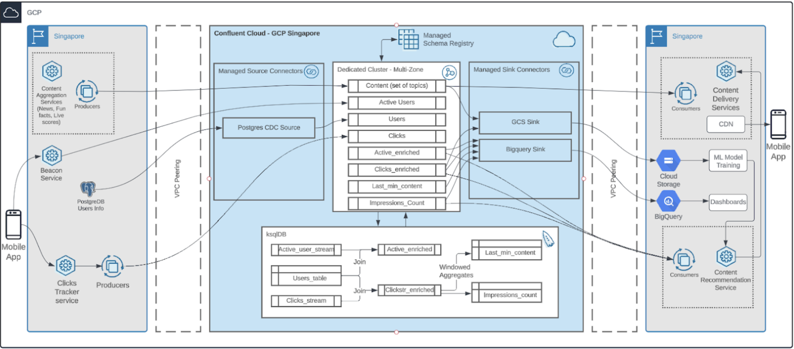
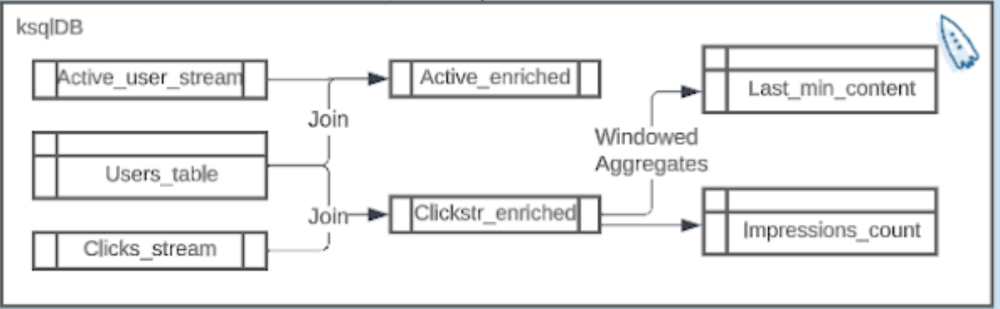

# Real-Time Mobile Personalization at Scale

In today’s hyper-connected era, customers demand nothing less than instant access to tailor-made, meaningful content that resonates with their individual needs and preferences.This post details how organizations can leverage the power of cloud-native data streaming in Confluent Cloud and features such as fully managed source and sink connectors for PostgreSQL CDC, BigQuery, stream processing and stream governance, to create personalized and relevant content for different customers segments to keep them engaged with their brand and keep them coming back for more.


## Architecture Diagram

Content for the users is generated both in-house and from the external sources. All the content is aggregated using the content aggregation service, categorized, and produced in real time to Confluent Cloud. This is streamed on to the content delivery service, which, in conjunction with the intelligence provided by the content recommendation service, serves interesting and relevant content for each user. A copy of the content is streamed into Cloud Storage for training ML models and for archival purposes. ML models now have access to all the content in real time. The organization can now choose to retrain the models in as little as a few minutes. There is usually a trade-off between the cost of retraining and accuracy. However, the organization has the flexibility now to retrain as and when needed.

A beacon service keeps track of the endpoints where the application is actively being used. This information is needed for tracking app usage in real-time for dashboard and reporting purposes. Additionally, it is also required for the recommendation service to prepare for the next relevant content to be delivered to active users. The recommendation service uses the beacon’s data to determine the content only for active users, resulting in efficient use of the resources and saving cost. The data captured by the beacon service is very minimal. Previously,  the organization had to do a lookup with the user’s data present in Postgres DB for enrichment. This approach slowed down the Postgres DB from performing its normal functions. This got a lot better on Confluent Cloud when the organization started streaming Users data from Postgres DB using a managed CDC Source connector to Kafka. Confluent’s real-time stream-processing engine ksqlDB helped create a materialized view of the Users data using ksqlDB tables. Now, the latest user info is always available in ksqlDB. Using stream-table joins, Confluent Cloud helped to enrich the Active Users data by joining required User attributes, all in real time. They are also exploring how Apache Flink can help to expand the scope of real-time stream processing.

All the user interactions with the content such as clicks/watches/scrolls are captured by the mobile app and relayed to the clicks tracker service, which publishes it to Confluent Cloud. This again required additional information related to user attributes, which was achieved using similar ksqlDB stream-table joins. One of the significant architectural advantages with Confluent Cloud is the ability to read the same data multiple times by individual consumers for various use cases. This is called fanout, which is supported inherently in the platform. This helped the organization save costs without duplicating the same message into multiple queues. Dashboarding and reporting in real-time was possible using Google Cloud BigQuery Managed Sink Connector collecting all the data from the required topics and sinking it into Google BigQuery, which in turn is integrated with visualization tools.

<div align="center"> 
  
</div>


## Overview
By following this GitHub repository you can get you Confluent cloud setup required for Real-Time Mobile Personalization at Scale up and running.
Environment, Service Account,API Keys,connectors,Topic, KSQL Cluster,Streams,Table and everything required will be up and running in your Cloud account.
Please note you might need to add you own producers later on ad Datagen connectors have been used here to mock the real time data.

# Requirements

In order to successfully complete this demo you need to install few tools before getting started.

- If you don't have a Confluent Cloud account, sign up for a free trial [here](https://www.confluent.io/confluent-cloud/tryfree).
- Install Confluent Cloud CLI by following the instructions [here](https://docs.confluent.io/confluent-cli/current/install.html).
- Please follow the instructions to install Terraform if it is not already installed on your system.[here](https://developer.hashicorp.com/terraform/tutorials/aws-get-started/install-cli)  

## Prerequisites

### Confluent Cloud

1. Sign up for a Confluent Cloud account [here](https://www.confluent.io/get-started/).
1. After verifying your email address, access Confluent Cloud sign-in by navigating [here](https://confluent.cloud).
1. When provided with the _username_ and _password_ prompts, fill in your credentials.

   > **Note:** If you're logging in for the first time you will see a wizard that will walk you through the some tutorials. Minimize this as you will walk through these steps in this guide.

1. Create Confluent Cloud API keys by following the steps in UI.Click on the button that is present on the right top section and click on Cloud API Key.
<div align="center"> 
  
</div>

 Now Click Add Key to generate API keys and store it as we will be using that key in this demo.
 <div align="center"> 
  
</div>
    
   > **Note:** This is different than Kafka cluster API keys.

## Setup
The terraform script provided will help you automate everything that you need in your cloud account from Environment,Sevice account to KSQLdb Cluster.
Please note that you need to run KSQL queries manually in order create streams, tables and perfrom joins.

**NOTE: For BigQuery Sink Connector to work you need to create the cluster in the same region as your GCP**
1. This demo uses Terraform  to spin up resources that are needed.

2. Update the `terraform/variables.tf` file for the following variables with your Cloud API credentials.

```
variable "confluent_cloud_api_key" {
  
  default = " Replace with your API Key created during pre-requsite"   
}

variable "confluent_cloud_api_secret" {
  default = "Replace with your API Key created during pre-requsite"   
}
```
3. Also, please change the place holders for PostgresCDC and BigquerySink connectors.

4. We Use postgresDB to fetch the Click data of the User. Make sure you have columns like userID,liked,shared(whether the user had liked or shared the content or not.Basically a yes or no column.)

 ### Build your cloud infrastructure

1. Navigate to the repo's terraform directory.
   ```bash
   cd <folder_name>
   ```

1. Initialize Terraform within the directory.
   ```
   terraform init
   ```

1. Apply the plan to create the infrastructure.

   ```
   terraform apply 
   ```

   > **Note:** Read the `main.tf` configuration file [to see what will be created](./terraform/main.tf).

 # Demo

We do not use any Producers to mock the data instead we used Datagen connectors for the sake of it. 
The Datagen Connectors provided in the Terraform code generate some sample User data.

#### Enrich Data Streams with ksqlDB

Now that you have data flowing through Confluent, you can now easily build stream processing applications using ksqlDB. You are able to continuously transform, enrich, join, and aggregate your data using simple SQL syntax. You can gain value from your data directly from Confluent in real-time. Also, ksqlDB is a fully managed service within Confluent Cloud with a 99.9% uptime SLA. You can now focus on developing services and building your data pipeline while letting Confluent manage your resources for you.

<B>This section will involve the creation of multiple Streams that will enrich the existig streams using joins and also get some windowed aggregates.The Users, Activr users and the Clicks data will be imvolved in these joins to create these Enriched streams and aggregates.<B>

If you’re interested in learning more about ksqlDB and the differences between streams and tables, I recommend reading these two blogs [here](https://www.confluent.io/blog/kafka-streams-tables-part-3-event-processing-fundamentals/) and [here](https://www.confluent.io/blog/how-real-time-stream-processing-works-with-ksqldb/).

1. On the navigation menu click on **ksqlDB** and step into the cluster you created during setup.
   To write streaming queries against topics, you will need to register the topics with ksqlDB as a stream or table.

2. **VERY IMPORTANT** -- at the bottom of the editor, set `auto.offset.reset` to `earliest`, or enter the statement:

   ```SQL
   SET 'auto.offset.reset' = 'earliest';
   ```

   If you use the default value of `latest`, then ksqlDB will read form the tail of the topics rather than the beginning, which means streams and tables won't have all the data you think they should.

3. Build Streams on topics Active_Users and Clicks.= For achieving this you can use the following command. Pleae note, Columns here are basically Feild names in the topic.
```SQL
CREATE STREAM Stream_Name (
    Col 1 DataType,
    Col 2 DataType,
    Col 3 DataType
) WITH (
    kafka_topic = 'Topic_name',
    partitions = #,
    value_format = 'json/avro/protobuf/etc..' (Choose the the appropriate format)
);
```

4. For the topic Users we are going to build a Table. You can use this command for building the table:
```SQL
CREATE TABLE Users (user_id VARCHAR PRIMARY KEY, regionid VARCHAR , gender VARCHAR)
    WITH (kafka_topic='Users', partitions=6, value_format='json');
);
``` 

5. Now we need to perform Stream-Table join between Active_Users stream and Users table. This will essentially create a new stream Active_enriched.
``` SQL
CREATE STREAM Active_enriched AS
  SELECT 
     userid,  
     regionid, 
     gender 
  FROM Active_users
    LEFT JOIN users ON Active_users.userid = users.userid
  EMIT CHANGES;
```

6.We also have to join Clicks and Users in the similar way and get a Clicks_enriched stream.
``` SQL
CREATE STREAM Clicks_enriched AS
  SELECT 
     userid,  
     content_opened, 
     liked,
     shared
  FROM Clicks
    LEFT JOIN users ON Clicks_stream.userid = users.userid
  EMIT CHANGES;
```
7. Now from Clicks_enriched Stream we further create two more streams Last_min_content and Impression_Count
```SQL
CREATE TABLE Last_min_content AS
select * from Clicks_enriched
WHERE content_opened ="yes"
WINDOW TUMBLING (SIZE 5 MINUTES)  -- Adjust the window size as needed
GROUP BY userid
EMIT CHANGES;
```

```SQL
Create Stream Impression_count AS
Select * from Clicks_enriched
WHERE liked="yes"
OR shared="yes"
EMIT CHANGES;
```

8. Last_min_content is popular content in last 5 minutes where customer opened the content (not just clicked)
Impressions_Count stream describes if they liked, shared the content.

9. The KSQL Stream flow diagram is attached for your reference
 <div align="center"> 
  
</div>


## Connect External System  to sink Enriched Events from  Confluent Cloud using Connector

You can create  Sink connector either through CLI or Confluent Cloud web UI.

<details>
    <summary><b>CLI</b></summary>

1. Run the following command to create the  Sink connector.

   ```bash
   confluent connect cluster create --config-file confluent/connect_config.json
   ```

**Note:** Before executing the command, substitute the connect properties with the filename that you are using.

</details>
<br>

<details>
    <summary><b>Confluent Cloud Web UI</b></summary>

1. On the navigation menu, select **Connectors** and **+ Add connector**.
1. In the search bar search for your connector and select the connector.
1. Create a new  Sink connector and complete the required fields.

</details>
<br>

Once the connector is in **Running** state navigate to your database/external system and verify messages are showing up correctly.

Refer to our [documentation](https://www.confluent.io/product/connectors/) for detailed instructions about the  connector that are available.

## Congratulations

By utilizing SQL-like commands, we have developed a real-time mobile presentation event processing system that calculates the impression count for each user in real-time. This system can send the results to the bigquery where we can run our ML/CDN models as shown in the architecture diagram, improving the overall user experience or to other external systems.With this system, we can process and analyze data in real-time, allowing for better decision-making and driving better business outcomes.

# Teardown

You want to delete any resources that were created during the demo so you don't incur additional charges.


## Infrastructure

1. Run the following command to delete all resources created by Terraform
   ```bash
   terraform apply -destory

## Confluent Cloud Stream Governance

Confluent offers data governance tools such as Stream Quality, Stream Catalog, and Stream Lineage in a package called Stream Governance. These features ensure your data is high quality, observable and discoverable. Learn more about **Stream Governance** [here](https://www.confluent.io/product/stream-governance/) and refer to the [docs](https://docs.confluent.io/cloud/current/stream-governance/overview.html) page for detailed information.

1.  Navigate to https://confluent.cloud
1.  Use the left hand-side menu and click on **Stream Lineage**.
    Stream lineage provides a graphical UI of the end to end flow of your data. Both from the a bird’s eye view and drill-down magnification for answering questions like:

    - Where did data come from?
    - Where is it going?
    - Where, when, and how was it transformed?
    
# References

1. Connectors for Confluent Cloud [doc](https://docs.confluent.io/platform/current/connect/index.html)

2. Peering Connections in Confluent Cloud [doc](https://docs.confluent.io/cloud/current/networking/peering/index.html)
3. ksqlDB [page](https://www.confluent.io/product/ksqldb/) and [use cases](https://developer.confluent.io/tutorials/#explore-top-use-cases)
4. Stream Governance [page](https://www.confluent.io/product/stream-governance/) and [doc](https://docs.confluent.io/cloud/current/stream-governance/overview.html)

  
